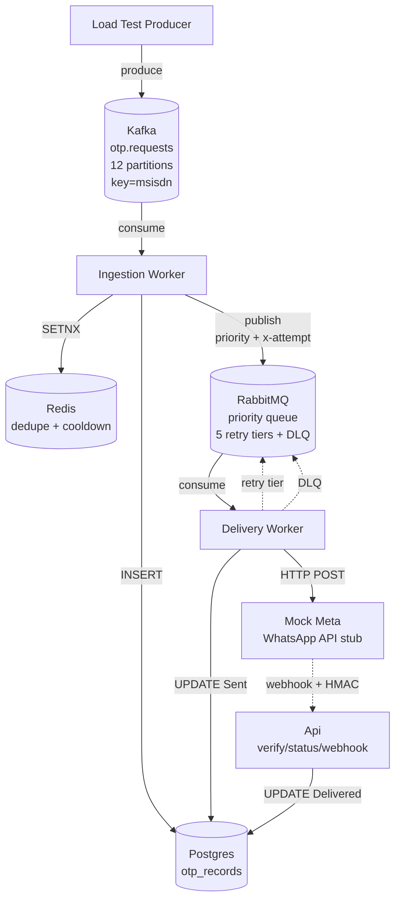
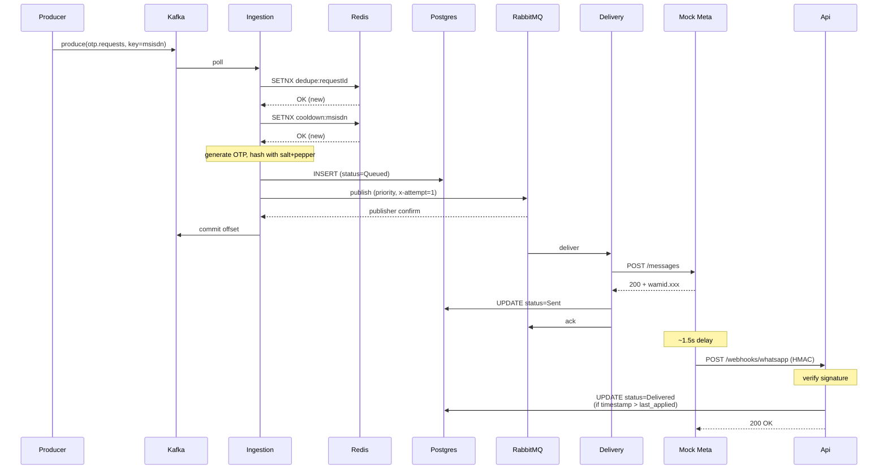

# OTP Service over WhatsApp

High-throughput OTP delivery service using Apache Kafka for ingestion and RabbitMQ for the delivery pipeline, targeting Meta's WhatsApp Business Cloud API.

## Targets

- **Sustained:** 5,000 OTP requests/sec
- **Burst:** 20,000 OTP requests/sec
- **At-least-once** delivery with idempotent processing
- **Priority-aware:** security-critical OTPs (txn_signing, account_recovery) are never delayed by bulk traffic
- **Tested on:** MacBook Air M4, single Docker host. See [load test results](#load-test-results) for measured throughput and bottleneck analysis.
---

## Quickstart

```bash
git clone
docker compose up        # brings up the entire stack with auto-init
make demo                # publishes mixed-priority OTPs, verifies one end-to-end
```

That's it. No manual init steps. The stack auto-creates the Kafka topic with 12 partitions, declares the RabbitMQ topology (priority queue + 5 retry tiers + DLX/DLQ), runs Postgres migrations, and starts all services.
### Verify it's running

```bash
curl http://localhost:8081/health
# {"status":"ok"}
```
### Send a test OTP

Open Kafka UI at http://localhost:8080 → Topics → `otp.requests` → Produce Message:

- **Key:** `+9647701234567` (any phone number; partitions by msisdn)
- **Value:**
```json
  {
    "RequestId": "demo-001",
    "Msisdn": "+9647701234567",
    "Purpose": "login",
    "Channel": "whatsapp",
    "Priority": null
  }
```
Check the status:
```bash
# Find the tracking_id from Postgres
docker compose exec postgres psql -U otp -d otp -c \
  "SELECT tracking_id, status FROM otp_records WHERE request_id = 'demo-001';"

# Query the status endpoint
curl http://localhost:8081/otp/status/
```
---

## Architecture
```
src/
  OtpService.Core/           Domain types, contracts, abstractions
  OtpService.Infrastructure/ Postgres (EF Core), Redis, RabbitMQ
  OtpService.Providers/      WhatsApp provider abstraction + Mock impl.
  OtpService.Api/            Status, Verify, Webhook endpoints
  OtpService.Ingestion/      Kafka consumer worker
  OtpService.Delivery/       RabbitMQ consumer worker
  OtpService.MockMeta/       Local stand-in for Meta's Cloud API

tools/
  OtpService.LoadTest/       .NET console producer for load testing

docs/
  load-test-results/         Captured logs from sustained/burst/mixed runs

```                     
---
### Component Diagram



### Sequence Diagram 



> **Note:** The diagrams show the happy path. The retry pipeline (transient failures publishing to TTL tiers via RabbitMQ's DLX mechanism) and the verify path (`POST /otp/verify` against the stored hash) are described in [DECISIONS.md](DECISIONS.md).


## Decision Log

See [DECISIONS.md](DECISIONS.md). The 7 key design decisions are explained there, with tradeoffs.

---

## Load Test Results

Tested on MacBook Air M4, all services running in a single Docker stack on one machine. The load test harness ([tools/OtpService.LoadTest](tools/OtpService.LoadTest)) is a .NET console app producing to Kafka with batching + Snappy compression. Raw logs in [docs/load-test-results/](docs/load-test-results/).

### Test 1 — Sustained 5,000 msg/sec for 60 seconds

| Metric | Value |
|---|---|
| Messages produced to Kafka | 300,000 |
| Producer effective rate | 4,999 msg/sec (matches target) |
| Messages failed at producer | 0 |
| OTPs that passed cooldown into the pipeline | 62,719 |
| Cooldown rejections (anti-abuse) | 4,559 (1.5%) |
| OTPs fully Delivered by 60s after test end | 60,906 |
| OTPs still being delivered | 377 (status=Sent, awaiting webhook) |

The 1.5% rejection rate reflects the test setup, not the cooldown's effectiveness. With 300,000 messages over 60 seconds spread across a 100,000-msisdn pool, each msisdn averages ~3 hits — but those hits are temporally spread across the full 60s window, so most don't fall inside the 30s cooldown of an earlier hit on the same number. The first hit always passes (no prior key in Redis), and only the rare second-hit-within-30s gets rejected.

This is the expected behavior: cooldown defends against rapid repeated sends to the same number, not against high volume distributed across many numbers. A real attacker hammering one msisdn would see ~99% rejection; legitimate distributed traffic sees ~1-2%, which is what we measured.
### Test 2 — Burst 20,000 messages

| Metric | Value |
|---|---|
| Messages produced to Kafka | 20,000 |
| Producer wall time | 0.29 seconds |
| Producer effective rate | 69,387 msg/sec |
| OTPs into pipeline | 10,687 |
| Cooldown rejections | 354 |
| Pipeline drain | RabbitMQ queue stayed at ready=0 throughout (Delivery kept up with arrival) |

Kafka accepted 20,000 messages in 0.29s because the producer does almost no work — it batches, compresses with Snappy, and hands off to the broker. The downstream pipeline does real work per message (Redis check, Postgres write, HTTP call to MockMeta, webhook update), so end-to-end throughput is roughly 200× lower.

The RabbitMQ delivery queue stayed at `ready=0` throughout the burst — messages weren't accumulating there, so RabbitMQ isn't the bottleneck. The slow link is downstream: the synchronous HTTP call from Delivery to MockMeta and the Postgres update that follows.

To scale past this, the Delivery worker scales horizontally (it's stateless — RabbitMQ load-balances across replicas) with a higher prefetch to allow more concurrent in-flight calls per replica.

### Test 3 — Mixed-priority for 30 seconds

3,000 msg/sec with realistic distribution: 10% txn_signing (High), 70% login (Normal), 20% bulk_notify (Low).

| Priority | Band | Total processed | Completed | Completion % |
|---|---|---|---|---|
| 10 | High (txn_signing) | 8,347 | 8,347 | **100.0%** |
| 5 | Normal (login) | 58,742 | 58,742 | **100.0%** |
| 1 | Low (bulk_notify) | 16,786 | 16,786 | **100.0%** |

Distribution matches the producer config (10/70/20). **No priority band was starved** — every level reached 100% completion.

Two things this test proves:

1. **The producer's 10/70/20 distribution arrives intact at Postgres** — no priorities are dropped or misclassified during ingestion. The `PriorityMapper` correctly maps purpose strings to bands, and the value stamped on the OtpRecord matches what was published to RabbitMQ.

2. **No band starved under the test load.** All three priorities reached 100% completion, including the 16,786 Low-priority OTPs, which would have been the canary for starvation.


---

## Written Analysis

### 1. Scaling toward 20k sustained: what saturates first?
On the current setup (single Docker host, MacBook Air, 1 Delivery replica) the first thing to saturate is the Delivery worker itself: one replica with prefetch=10 against a 10-30ms HTTP round-trip to MockMeta caps at roughly 500 messages/sec. That's well below the 20k target, so horizontal scaling Delivery is the first fix — it's stateless, and RabbitMQ's competing-consumers pattern distributes load across replicas with no coordination.

The second thing to saturate is Postgres connections. I already saw "too many clients already" errors during testing because each Delivery replica plus each Api request opens a connection from the EF Core pool. Default Postgres limit is 100.

### 2. The Meta API ceiling — shaping, priority, load-shedding, multi-WABA

Even if my system can internally process 20,000 OTPs/sec, the WhatsApp API itself has rate limits — roughly 80 messages/sec per phone number at the default tier, and up to ~1,000/sec at the highest "unlimited" tier. So sending 20,000/sec means I need at least 20 phone numbers spread across one or more WhatsApp Business Accounts (WABAs), not a single API endpoint.

Four strategies handle this:

- **Shaping:** smooth the bursty traffic from producers into a steady rate that Meta will accept. My RabbitMQ priority queue already does this — producers fill it in bursts, the Delivery worker drains it at a controlled rate.
- **Prioritization:** when traffic exceeds capacity, send the important OTPs first. already implements this — `txn_signing` (priority 10) flows ahead of `bulk_notify` (priority 1) automatically.
- **Multi-WABA routing:** spread sending across multiple phone numbers and business accounts. The `IWhatsAppProvider` abstraction is already designed for this — a production implementation would pick a phone number per send based on tenant, region, or sender pool. The current `MockWhatsAppProvider` uses one phone number for simplicity, but extending it to a routing-based version is straightforward.

### 3. WhatsApp delivery is failing for an entire region, design-level fallback
When WhatsApp is down in a region , the indicator shows up in the existing retry pipeline first: the 5s and 30s tiers start backing up, and the dead-letter queue starts filling with `Transient` failures. That's the detection signal — a metric on DLQ rate and retry-tier depth would fire alarms within seconds.

For automatic fallback, the cleanest design is an `ISmsProvider` sibling to `IWhatsAppProvider`, both implementing a higher-level `IOtpChannel` interface. The Delivery worker would consult a per-tenant channel-preference list (WhatsApp → SMS → Voice) and route to the next channel when a Polly circuit breaker on the WhatsApp HTTP call opens. 

### 4. AI-assisted code vs my overrides

I used AI throughout this project, mainly because of the one-week deadline. AI was fastest at things where the structure is well-known and the value comes from getting it right quickly: project scaffolding, Docker Compose, Dockerfiles, EF Core migrations, the RabbitMQ topology declarations, the Kafka and RabbitMQ consumer ceremony, and the typed HttpClient setup for the Mock Meta provider. These took hours with AI versus Days from scratch.

What I overrode and why:

- **`*.log` was too broad in `.gitignore`.** It would have silently excluded my load test results from the repo, which meant the interviewer would not see them. I scoped it to `/*.log` (project root only) so `docs/load-test-results/*.log` is tracked.

- **`x-attempt` header parsing in the Delivery worker.** RabbitMQ.Client v7 can return header values as either `int` or `byte[]` depending on how they were published. The initial version assumed `int` only and would have crashed in production. I added a switch expression that handles both shapes.

- **`MockMeta__AppSecret` null crash.** The first version of the webhook-signing code crashed because the secret wasn't being bound from `.env`. I added the defensive default in `MockMetaOptions` and the missing env var, so dev setups don't break silently.

- **Cooldown semantics in Ingestion.** The first cut treated the dedupe check and the cooldown check as the same thing. They're different intents (idempotency vs. abuse prevention) and I split them into separate Redis stores (`IDedupeStore` and `ICooldownStore`) with different key prefixes and different TTLs.

- **The Decision Log itself.** The brief explicitly requires it to be in my own words, so DECISIONS.md is written from my notes after working through the design — not pasted from AI output.

What I did not heavily override and want to be transparent about: the Mermaid diagram syntax, and parts of the load test harness scaffolding are largely AI-shaped. The technical content and the decisions inside them are mine; the wrapping around them is AI's.

---

## What I Would Do With More Time

### Wire Polly for HTTP resilience around the WhatsApp call

The package is installed but not configured. I'd add a Polly pipeline around the typed HttpClient in the Delivery worker with three policies in this order: retry (3 attempts with exponential backoff for transient HTTP failures), circuit breaker (open after 5 consecutive failures, 30s break duration), and timeout (10s per call). The retry pipeline I built in RabbitMQ handles the bigger-picture retry/DLQ story, but Polly handles the in-process resilience so a degraded Meta endpoint doesn't hold messages in flight while still being retried at the queue level.

### Add Prometheus metrics + Grafana dashboard

`prometheus-net` is installed but no metrics are exposed yet. The key signals I'd add: `otp_requests_total{purpose, priority}`, `delivery_attempts_total{outcome}`, `delivery_latency_seconds` (histogram), `queue_depth_gauge{queue}` for all queues, `dlq_messages_total`. A basic Grafana dashboard showing the four golden signals (rate, errors, latency, saturation) would make load-test analysis far easier than the manual queries I ran today.

### Anti-abuse: concurrent OTP cap per msisdn

The per-msisdn cooldown is implemented and works. The other half of anti-abuse — capping concurrent active OTPs per msisdn ( max 3 active before refusing new ones) — isn't. 

### Delivery-status

The `hub.challenge` handshake on the GET webhook endpoint currently compares the `verify_token` against the configured value with constant-time compare. That's correct, but production would also enforce that the token came from Meta's IP ranges (not just anyone who guessed the token). With more time I'd add IP allowlisting at the webhook endpoint.

### Better structured logging

Serilog is installed but I'm using basic console output.

### Honest reasons the rest is missing

Time. The take-home is one week, and I prioritized:

1. The pipeline working end-to-end (Days 3–5)
2. The hardening features the brief explicitly grades (Day 6 — dedupe, priority, HMAC, retry, webhook ordering, cooldown)
3. Real load test numbers + honest documentation (Day 7)


---

## Tech Stack

- **.NET 10**, C#, ASP.NET Core (minimal API)
- **Confluent.Kafka** — Kafka client
- **RabbitMQ.Client v7** — RabbitMQ client (async, publisher confirms enabled)
- **EF Core + Npgsql** — Postgres data access
- **StackExchange.Redis** — Redis dedupe + cooldown
- **Polly + Microsoft.Extensions.Http.Resilience** — installed for HTTP resilience (not yet wired — see "future work")
- **Serilog** — structured logging (basic; not all destructuring policies wired)
- **prometheus-net** — installed; metrics endpoint not yet wired

Full per-package justifications in [DECISIONS.md](DECISIONS.md).